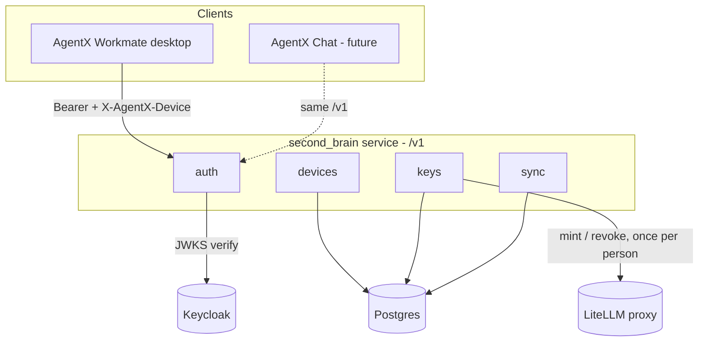
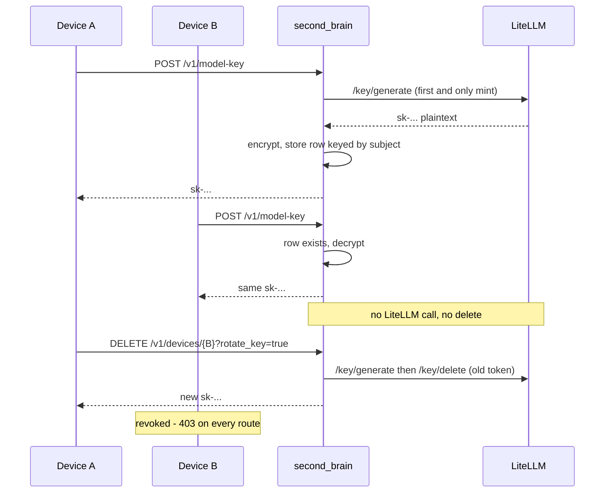
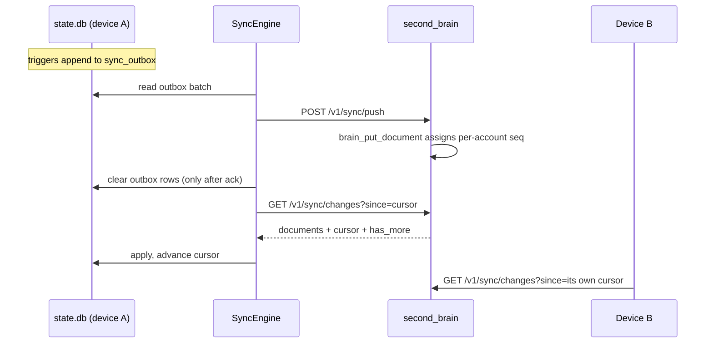

# feat: One model key, one history, many devices — the AgentX Second Brain service

## Summary

Signing in on a second device today breaks the first one. The LiteLLM virtual key each person receives is looked up by an alias derived from their immutable `sub` claim, so every machine that person owns competes for the same alias — and both mint paths delete the existing key before minting a new one. The second sign-in revokes the first machine's key permanently; the first machine then rotates and revokes the second. One person can only ever hold one working device at a time.

This plan replaces per-laptop minting with a central service, `second_brain`, that mints once per person, stores the key encrypted, and hands the same key back to every device. The same service carries a device registry (so Settings can list and revoke sign-ins) and a change feed (so conversation history converges across devices). All three ride on the same two primitives — verify a Keycloak bearer into a `sub`, and a durable per-account store — which is why they are one service rather than three.

The service is designed from the first commit to grow into a second brain shared by AgentX Workmate and a future AgentX Chat: the content table is kind-agnostic, the API is versioned, and authorization is `sub`-scoped.

---

## Problem Frame

`account_slug_for_identity` derives a person's account slug from the immutable `sub` claim, deliberately, so the same person lands in the same home on every machine (`hermes_cli/accounts.py:20-27`). `LiteLLMAccountSettings.alias_for` then builds the key alias as `{key_alias_prefix}-{account_slug}` (`hermes_cli/account_provisioning.py:97`). Those two facts together mean **every machine a person signs in on asks LiteLLM for the same alias**.

LiteLLM returns a virtual key's plaintext exactly once; `/key/list` and `/key/info` answer with the hash only (`hermes_cli/litellm_admin.py:12-19`). So the plaintext exists solely in the `.env` of the machine that minted it. A second machine has no copy, fails the reuse branch in `ensure_account_key` (`hermes_cli/account_provisioning.py:543-547`), and falls through to `_rotate` → `_mint_direct`, which does this:

```python
# hermes_cli/account_provisioning.py:313-315
existing = client.keys_for_alias(alias)
if existing:
    client.delete_keys([record.token for record in existing])
return client.generate_key(...)
```

`hermes_cli/litellm_broker.py:182-184` repeats the same three lines server-side, so deploying the broker as-is does not fix this — it only moves where the deletion happens.

The comment above that delete is correct about *why* it exists ("LiteLLM cannot hand back an existing key's plaintext, so reaching here means we have no usable copy of it") but was written assuming one person means one machine. That assumption is the defect.

Two consequences follow from the same root:

- **Ping-pong revocation.** Device A loses its key when device B signs in. A's next sign-in sees `key_is_live` return False, rotates, and revokes B.
- **Behaviour drift between keys.** The `vector_store_ids` 400 in the user's screenshot is not produced by any code in this repository — the string appears nowhere in it. LiteLLM injects the parameter and forwards it to the `hosted_vllm` upstream, which rejects it. It surfaces on the second device because that device minted a *new* key, and a key minted today inherits whatever key-level defaults the proxy applies now (`object_permission`, `default_internal_user_params`), while the older key predates them. Removing unintended re-minting removes the drift; the proxy configuration should still be audited once.

Separately, nothing in an account home is shared between machines. Sessions and messages live in `<account home>/state.db` (`hermes_state.py:268`); memories, plans, skills and cron live beside it. There is no server. The `sync_server/` directory exists on disk but holds no git-tracked file.

---

## Requirements

- R1. One model key per person, returned unchanged to every device that person signs in on.
- R2. Conversation history converges across a person's devices, in both directions.
- R3. Settings lists the devices a person is signed in on and can revoke any of them.
- R4. No laptop and no shipped installer holds the LiteLLM admin key.
- R5. Revoking a device must be able to cut that device's model access in the same action.
- R6. A device that cannot reach the service keeps working with the key it already holds; unreachable must never be read as revoked.
- R7. The change-feed cursor must never skip a record, including under concurrent pushes from two devices.
- R8. Adding a new synced content type must not require a schema change on either side.
- R9. The in-repo deploy directory must not be able to leak a secret into a public repository.
- R10. Every phase ships independently and leaves the product in a consistent state if work stops there.

---

## Key Technical Decisions

- **One service, four modules.** All three requirements need bearer verification and a per-account store. Three services would mean three deploys of the same auth code and three chances to drift from the realm — the argument `litellm_broker._keycloak_provider` already makes for reusing the dashboard's provider. Module boundaries inside the process stay hard so splitting later is mechanical.

- **The service stores the key plaintext, envelope-encrypted.** This is the only way to satisfy R1 given that LiteLLM reveals plaintext once. It is strictly better than the status quo, where the plaintext sits in cleartext `.env` on every laptop *and* the admin key ships inside every installer. AES-256-GCM, KEK from the environment, `subject` as AAD, `kek_id` per row so the KEK can be rotated without downtime.

- **Delete-by-alias is removed from every path.** Only explicit rotation deletes a key, and only the service performs it. Because the service hands the key back on demand, rotation is self-healing: other devices fetch the new key on their next call instead of breaking.

- **The change-feed cursor is a per-account counter assigned inside the writing transaction**, not a global `BIGSERIAL`. A global sequence lets transaction 105 commit after a reader has already advanced past 106, silently losing 105 forever. Locking the `accounts` row serialises per person — cheap, since one person has a handful of devices — and makes the cursor a true watermark.

- **The outbox is fed by SQLite triggers**, not by threading calls through every write site. This is the idiom `state.db` already uses for FTS. The session trigger uses `AFTER UPDATE OF <named columns>` for the same reason the FTS trigger does: `sessions` is updated constantly for token and cost counters, and an untargeted trigger would turn the outbox into a firehose.

- **`messages` needs a portable identity.** Its primary key is `INTEGER PRIMARY KEY AUTOINCREMENT` — a local row number that cannot be a sync key. A `uuid` column is added and filled by trigger, so no insert site changes.

- **Serialization reuses `export_session` / `import_sessions`** (`hermes_state_portability.py:266`, `:376`) rather than introducing a second serializer that can drift from the first.

- **End-to-end encryption is out of scope permanently.** A second brain that answers questions must be able to read the content; E2E and the stated future are mutually exclusive. The protection level is TLS in transit, encryption at rest, and per-`subject` row isolation enforced from the verified token.

- **Postgres in tests, never a SQLite stand-in.** An abstraction spanning two SQL dialects is precisely the debt this plan is meant to avoid.

---

## High-Level Technical Design



Key issuance, which is where the reported bug lives:



Synchronisation:



---

## Implementation Units

Units are grouped into five phases. Each phase is independently shippable; the phase boundary is where work can stop without leaving the product inconsistent (R10).

### Phase 0 — Data foundation (no server involved)

Phase 0 carries the whole migration risk and no feature risk. It ships dark: nothing user-visible changes, and no network call is added.

### U1. Declare the sync schema in state.db (v26)

**Goal:** `state.db` gains the columns, tables, indexes and triggers synchronisation needs, with no behaviour change.

**Requirements:** R2, R7

**Dependencies:** None

**Files:**
- `hermes_state_common.py`
- `tests/hermes_state/test_sync_schema.py`

**Approach:**
- Bump `SCHEMA_VERSION` from 25 to 26.
- Add `updated_at REAL` to the `sessions` block of `SCHEMA_SQL` and `uuid TEXT` to the `messages` block. `_reconcile_columns` (`hermes_state_schema.py:335`) makes column addition declarative — no migration code is needed for the columns themselves.
- Add `sync_outbox(id INTEGER PRIMARY KEY AUTOINCREMENT, kind TEXT, doc_id TEXT, op TEXT, queued_at REAL)` and `sync_state(id INTEGER PRIMARY KEY CHECK (id = 1), cursor INTEGER NOT NULL DEFAULT 0, last_pull_at REAL, last_push_at REAL, last_error TEXT)` to `SCHEMA_SQL`.
- Add to `DEFERRED_INDEX_SQL`: a unique partial index on `messages(uuid) WHERE uuid IS NOT NULL`, and an index on `sync_outbox(id)`.
- Add `SYNC_TRIGGER_SQL` next to `FTS_SQL`, and a `_SYNC_TRIGGERS` name tuple next to `_FTS_TRIGGERS` so trigger reconciliation can find them.
- The message trigger must fill `uuid` **and** enqueue in one trigger body. Two separate `AFTER INSERT ON messages` triggers do not work: `new.uuid` in the second trigger still reads the value as it was at INSERT time (NULL) regardless of what the first trigger updated. Fill first, then `INSERT ... SELECT uuid FROM messages WHERE id = new.id`.
- The session update trigger must be `AFTER UPDATE OF title, display_name, archived, pinned, last_read_at, ended_at, end_reason, model, parent_session_id`. Token counters, cost fields, `last_activity_*` and compression fields are deliberately excluded — they change on nearly every turn and carry nothing another device needs.
- The session update trigger also stamps `sessions.updated_at`, which is the LWW tiebreak.

**Patterns to follow:**
- `FTS_SQL` and `_FTS_TRIGGERS` in `hermes_state_common.py` — the `UPDATE OF` narrowing there exists for the same I/O reason.
- `_reconcile_columns` and `_parse_schema_columns` in `hermes_state_schema.py`.

**Test scenarios:**
- Opening a v25 database with real rows produces a v26 schema with both new columns and both new tables, and no row is lost.
- Inserting a message produces exactly one `sync_outbox` row whose `doc_id` equals the `uuid` just generated on that message.
- Updating a session's token counters produces no outbox row.
- Updating a session's `title` produces exactly one outbox row and advances `sessions.updated_at`.
- Deleting a session produces a `delete` outbox row.
- Two messages inserted in the same transaction get distinct `uuid` values.

**Verification:** Schema tests prove the trigger set fires exactly where intended and nowhere else.

### U2. Backfill message UUIDs in resumable batches

**Goal:** Existing history gets portable identities without stalling the first launch after an update.

**Requirements:** R2

**Dependencies:** U1

**Files:**
- `hermes_state_schema.py`
- `tests/hermes_state/test_sync_schema.py`

**Approach:**
- Add `_backfill_message_uuids(cursor)` shaped like the existing `_dedupe_legacy_system_prompts`, called from the migration block.
- Process in batches of 2000 rows, recording progress in `state_meta` under `sync_uuid_backfill_progress` — the same mechanism `fts_rebuild_high_water` / `fts_rebuild_progress` already uses for a long-running rebuild.
- The pass must be resumable: interrupting mid-backfill and reopening continues from the recorded position rather than restarting.
- Measure on a real multi-hundred-thousand-message `state.db` before this ships. If a full pass is slow, it runs incrementally across launches rather than blocking one.

**Patterns to follow:**
- `_dedupe_legacy_system_prompts` in `hermes_state_schema.py`.
- The `state_meta` progress-key convention used by the FTS rebuild.

**Test scenarios:**
- A database with 5000 pre-existing messages ends with every `uuid` populated and distinct.
- Interrupting after the first batch and reopening resumes rather than restarting.
- A database already fully backfilled performs no writes on the next open.
- `messages.id` values are unchanged by the backfill.

**Verification:** Migration tests run against a fixture database built at v25 with real message rows.

### U3. Add SessionSyncMixin to SessionDB

**Goal:** `SessionDB` gains the outbox/apply/cursor surface the sync engine needs, following the existing mixin split.

**Requirements:** R2

**Dependencies:** U1

**Files:**
- `hermes_state_sync.py` (new)
- `hermes_state.py`
- `tests/hermes_state/test_sync_mixin.py`

**Approach:**
- New module with `SessionSyncMixin`, following the mixin contract documented in `hermes_state_portability.py` and `hermes_state_schema.py`: no `__init__`, no state of its own, access to `self._conn` / `self._execute_write` established by `SessionDB.__init__`, and no import of `hermes_state` (cycle).
- Surface: `next_outbox_batch(limit)`, `mark_outbox_done(rows)`, `export_document(kind, doc_id)`, `apply_remote_documents(docs)`, `sync_cursor()`, `set_sync_cursor(cursor)`, `sync_status()`.
- `export_document` delegates to `export_session` for `kind='session'`; `apply_remote_documents` delegates to `import_sessions` after LWW filtering. No second serializer.
- `apply_remote_documents` must be idempotent — applying the same document twice is a no-op. This is what makes cursor reset a safe recovery (see Risks).
- Applying remote documents must not re-enqueue them into the outbox, or two devices will push each other's changes back and forth forever. Guard with a connection-scoped suppression flag checked by the triggers via `state_meta`, or by clearing the resulting outbox rows inside the same transaction. Decide during implementation and document which, with the reason.
- Register the mixin in `SessionDB`'s bases (`hermes_state.py:1874`) and import it beside the other three (`:75-77`).

**Patterns to follow:**
- `SessionPortabilityMixin` for the mixin contract and docstring shape.
- `export_session` / `import_sessions` for the document envelope.

**Test scenarios:**
- A round trip through `export_document` and `apply_remote_documents` reproduces a session and its messages exactly.
- Applying the same document twice changes nothing on the second pass.
- Applying a remote document does not leave rows in the local outbox.
- An older `updated_at` does not overwrite a newer local session.
- `sync_cursor` survives a reopen.

**Verification:** Mixin tests operate on two real temporary databases and compare row sets.

### U4. Give each desktop install a stable device id

**Goal:** Every install has an id that survives account switches and self-update, sent on every service call.

**Requirements:** R3

**Dependencies:** None

**Files:**
- `apps/desktop/electron/device-id.ts` (new)
- `apps/desktop/electron/device-id.test.ts` (new)
- `apps/desktop/electron/main.ts`

**Approach:**
- Pure functions with injected IO, mirroring `account-store.ts`: parsing is total, a corrupt or hand-edited file yields a fresh id rather than throwing during boot.
- Store at `userData/device.json`, following the one-file-per-concern convention already in `main.ts` (`accounts.json`, `connection.json`, `updates.json`, `window-state.json`).
- `userData`, not the account home: the id belongs to the install, so it must not change when a different person signs in.
- Send `X-AgentX-Device` and `X-AgentX-Device-Name` (hostname) on every service request; add them where `fetchJson` builds headers.

**Patterns to follow:**
- `apps/desktop/electron/account-store.ts` for the injected-IO shape and total parsing.
- `DESKTOP_ACCOUNT_CONFIG_PATH` and its neighbours in `main.ts:722-739`.

**Test scenarios:**
- First read generates an id and persists it.
- Subsequent reads return the same id.
- A malformed file yields a new valid id and does not throw.
- The id matches the UUID shape the service will accept.

**Verification:** Colocated tests run under `apps/desktop/scripts/test-desktop.mjs`.

---

### Phase 1 — Service and device management

Deployable on its own, and useful on its own: the first time anyone can see which machines a person is signed in on.

### U5. Scaffold the second_brain service and its store

**Goal:** A service that boots, migrates its database, and reports its own health.

**Requirements:** R7, R8, R10

**Dependencies:** None

**Files:**
- `second_brain/__init__.py`, `app.py`, `settings.py`, `errors.py` (new)
- `second_brain/store/__init__.py`, `store/engine.py`, `store/migrations/0001_init.sql` (new)
- `hermes_cli/subcommands/second_brain.py` (new)
- `hermes_cli/main.py`
- `pyproject.toml`
- `tests/second_brain/conftest.py`, `tests/second_brain/test_boot.py` (new)
- Delete the empty, untracked `sync_server/` directory

**Approach:**
- `build_app(provider=None, litellm=None, store=None, settings=None)` resolves its dependencies eagerly and raises on missing configuration, so a misconfigured deploy fails at deploy time rather than during someone's sign-in. This is the shape and the reasoning `litellm_broker.build_app` already uses.
- `store/engine.py` is the only module that writes SQL. Business modules call methods.
- `0001_init.sql` creates `accounts`, `devices`, `model_keys`, `documents` and the `brain_put_document` function. The function assigns `seq` from `accounts.doc_seq` inside the same transaction (see Key Technical Decisions) and performs the LWW-guarded upsert.
- Document in the function's comment that a rejected LWW upsert still consumes a `doc_seq`, leaving gaps in the sequence. Gaps are harmless — the cursor needs to be monotonic, not contiguous — but without the comment someone will "fix" it later.
- Register `agentx second-brain serve --host --port` beside the existing `broker` action (`hermes_cli/main.py:9426`), using the parser shape in `hermes_cli/subcommands/account.py`.
- Add a `second-brain` extra to `pyproject.toml`. `asyncpg==0.31.0` is already pinned by the `matrix` extra; use that same version rather than introducing a second one.
- `/health` reports Postgres and LiteLLM reachability separately.

**Patterns to follow:**
- `hermes_cli/litellm_broker.py` for dependency injection and eager configuration resolution.
- `hermes_cli/subcommands/account.py` for parser construction.

**Test scenarios:**
- Boot with a fresh database runs migrations and answers `/health`.
- Boot twice is idempotent.
- Missing KEK or missing Keycloak configuration refuses to start with an operator-readable message.
- `brain_put_document` assigns strictly increasing `seq` per account, and two accounts do not block each other.

**Verification:** Tests run against a real disposable Postgres provided by the fixture.

### U6. Verify identity and device on every request

**Goal:** Every route receives a verified `Principal`; no handler reads a raw header.

**Requirements:** R3, R5, R6

**Dependencies:** U5

**Files:**
- `second_brain/auth.py`
- `second_brain/errors.py`
- `tests/second_brain/test_auth.py` (new)

**Approach:**
- Obtain the Keycloak provider by registering the dashboard plugin through a capture object, exactly as `litellm_broker._keycloak_provider` does. Two verifiers that can drift is how a service ends up trusting a realm the app has already left.
- `Principal` carries `subject`, `email`, `display_name`, `issuer`, `device_id`.
- The account is always derived from the verified `sub`. A body field naming an account is logged when it disagrees and otherwise ignored — the rule `litellm_broker` already enforces.
- A JWKS or discovery outage answers `503 identity_unavailable`, never `401`. A `401` tells the laptop to discard its key; an outage must not (R6).
- A missing device header answers `400 device_header_missing`.
- A revoked device answers `403 device_revoked` on every route.

**Patterns to follow:**
- `hermes_cli/litellm_broker.py:57-80` and `:147-162`.
- `hermes_cli/dashboard_auth/base.py` `Session` for the verified-identity shape.

**Test scenarios:**
- A valid token resolves to the expected subject and slug, matching what `account_slug_for_identity` computes in the CLI.
- An expired or malformed token gets 401.
- An identity provider that raises gets 503, not 401.
- A request without a device header gets 400.
- A request from a revoked device gets 403 on every route including `/v1/me`.

**Verification:** Auth tests inject a fake provider so realm behaviour, including outage, is exercised without a network.

### U7. Device registry and revocation

**Goal:** The service records which machines a person uses and can cut one off.

**Requirements:** R3, R5

**Dependencies:** U6

**Files:**
- `second_brain/devices.py` (new)
- `tests/second_brain/test_devices.py` (new)

**Approach:**
- `POST /v1/devices/heartbeat` upserts `name`, `platform`, `app_version`, `last_seen_at`. Called on launch and on each sync tick.
- `GET /v1/devices` lists the caller's devices, marking the calling device `current`.
- `DELETE /v1/devices/{id}` sets `revoked_at`; `?rotate_key=true` also rotates the model key (wired in U10, stubbed until then).
- Revoking the last remaining device while rotating locks the person out of their own account: no device would be left to fetch the new key. Reject with `409 cannot_revoke_last_device`. Enforce this in the service, not only by hiding the button — any client can call the API.
- Devices belonging to another subject answer `404 device_not_found`, never `403`, so the endpoint does not confirm the existence of another person's device.

**Patterns to follow:**
- The `_require_session` / `_identity_from_session` split in `hermes_cli/web_routers/accounts.py`.

**Test scenarios:**
- Two devices heartbeating produce two rows, with exactly one `current: true` per caller.
- Revoking device B from device A returns 200; B then gets 403 everywhere and A is unaffected.
- Revoking a device id belonging to another account returns 404.
- Revoking the only device with `rotate_key=true` returns 409.
- Revoking the only device without rotation succeeds.

**Verification:** Device tests drive the real routes with two distinct device headers on one subject.

### U8. Ship the deploy directory and close the secret-leak gap

**Goal:** The service is deployable from this repository without any path by which a secret can be committed.

**Requirements:** R9

**Dependencies:** U5

**Files:**
- `deploy/second-brain/.gitignore`, `docker-compose.yml`, `Dockerfile`, `Caddyfile`, `Makefile`, `.env.example`, `README.md` (new)
- `.github/workflows/lint.yml`

**Approach:**
- The root `.gitignore:14` pattern `.env` already matches `deploy/second-brain/.env` — confirmed with `git check-ignore`. But it is a denylist: `git check-ignore deploy/second-brain/secrets.yaml` reports nothing. For a directory that exists to hold deployment configuration in a public repository, invert the default with an allowlist:

  ```gitignore
  *
  !.gitignore
  !docker-compose.yml
  !Dockerfile
  !Caddyfile
  !Makefile
  !.env.example
  !README.md
  !migrations/
  !migrations/**
  ```

- `.github/workflows/` currently runs no secret scanning of any kind — no gitleaks, no trufflehog. That was tolerable while no deployment configuration lived in the repository. Add a scanning job to `lint.yml` covering the whole tree, not just `deploy/`. An admin key has already shipped inside an installer once; this class of mistake is not hypothetical here.
- The README must cover: standing the service up from nothing including first KEK generation; rotating the KEK; restoring from `pg_dump`; and the retention policy.
- Document the restore consequence explicitly: after restoring Postgres to an earlier point, a client holding a cursor above the server's `doc_seq` silently pulls nothing forever. The fix is to reset that client's cursor to 0; re-pulling everything is safe because `apply_remote_documents` is idempotent (U3).

**Patterns to follow:**
- `docker-compose.yml` at the repository root for compose conventions and its security-note style.

**Test scenarios:**
- `docker compose config` validates.
- A staged file matching a secret shape under any path fails the scanning job.
- `.env.example` contains every variable the service reads, with no real values.

**Verification:** CI proves the scanner rejects a planted test secret; the compose file validates in `docker-lint.yml`.

### U9. Surface devices in Settings → Account

**Goal:** A person can see and revoke their sign-ins from the app.

**Requirements:** R3, R5

**Dependencies:** U4, U7

**Files:**
- `apps/desktop/src/app/settings/device-list.tsx` (new)
- `apps/desktop/src/app/settings/device-list.test.tsx` (new)
- `apps/desktop/src/app/settings/account-settings.tsx`
- `apps/desktop/src/store/account.ts`
- `apps/desktop/src/global.d.ts`
- `apps/desktop/electron/preload.ts`, `main.ts`
- `apps/desktop/src/i18n/{en,ja,zh,zh-hant,ar}.ts`, `types.ts`

**Approach:**
- Add a Devices section below the existing model-key row, built from `ListRow`, `Pill`, `SectionHeading` in `settings/primitives.tsx`.
- Add `$devices`, `refreshDevices`, `revokeDevice` to `store/account.ts` beside `rotateAccountKey`.
- The revoke control is one action — "Revoke device" — with a "also issue a new model key" checkbox **checked by default**. One shared key means revoking alone cannot cut model access; the safe default is cheap because rotation is self-healing (U10), so other devices recover without the user doing anything.
- Map `403 device_revoked` on this device to: clear the keychain tokens, clear the local key, show `SignInOverlay`. Reuse the sign-in gate rather than the boot-failure overlay — the same distinction `sign-in-overlay.tsx` was introduced to draw.
- Extend `types.ts` so all five locales are forced to carry the new keys.

**Patterns to follow:**
- `apps/desktop/src/app/settings/account-settings.tsx` for the table-driven status copy and the `ConfirmDialog` flow.
- `apps/desktop/src/components/sign-in-gate.ts`.

**Test scenarios:**
- The list renders devices with the current one marked.
- Revoking asks for confirmation and reports the outcome.
- The checkbox is checked by default and can be cleared.
- A 409 for the last device renders a specific explanation, not a generic failure.
- With the service unreachable, the section degrades to a message and does not block the rest of Settings.

**Verification:** Colocated React tests plus a manual pass on two machines.

---

### Phase 2 — Key vault

The phase that ends the reported bug.

### U10. Issue one model key per person, from the service

**Goal:** Every device receives the same key; LiteLLM mints once.

**Requirements:** R1, R5

**Dependencies:** U6, U7

**Files:**
- `second_brain/keys.py` (new)
- `tests/second_brain/test_keys.py` (new)

**Approach:**
- `POST /v1/model-key`: a stored row is decrypted and returned with no LiteLLM call at all; a missing row mints, encrypts and stores; `{"rotate": true}` mints a replacement, deletes the old token, and updates the row.
- AES-256-GCM with a 32-byte KEK from `AGENTX_BRAIN_KEK`, `subject` as additional authenticated data, `kek_id` stored per row so rotating the KEK is a re-encrypt job rather than an outage.
- There is no delete-by-alias path anywhere in this module. Deletion happens only during explicit rotation, and only against the `litellm_token` stored on the row.
- Never log plaintext. Log `mask_key()` from `hermes_cli/litellm_admin.py`.
- Audit the LiteLLM proxy's key-level defaults during this unit and record what was found: this is where the `vector_store_ids` injection originates, and freshly minted keys are what expose it.

**Patterns to follow:**
- `hermes_cli/litellm_admin.py` for the admin client and the reachable-versus-refused distinction.

**Test scenarios:**
- Two devices calling `POST /v1/model-key` receive an identical plaintext, and `/key/generate` is called exactly once.
- The second call issues no request to LiteLLM at all.
- Rotation returns a new key, deletes exactly the previously stored token, and the other device receives the new key on its next call.
- Decryption under a different subject's AAD fails and returns no plaintext.
- An unreachable LiteLLM during first issuance returns 503, not 500, and stores nothing.

**Verification:** Key tests drive both devices through the real routes against a `httpx.MockTransport` LiteLLM.

### U11. Move the laptop and the broker off minting

**Goal:** No laptop and no installer holds the admin key, and no code path deletes a key by alias.

**Requirements:** R1, R4

**Dependencies:** U10

**Files:**
- `hermes_cli/account_provisioning.py`
- `hermes_cli/second_brain_client.py` (new)
- `hermes_cli/config_defaults.py`
- `hermes_cli/litellm_broker.py`
- `apps/desktop/scripts/write-deployment-config.mjs`
- `tests/hermes_cli/test_account_provisioning.py`

**Approach:**
- Add `mode: "second_brain"` to `accounts.litellm` and make it the shipped default. `direct` and `broker` remain for existing installs.
- `_mint_direct` runs only under `mode == "direct"`, and logs a deprecation naming a removal date. No open-ended compatibility flag.
- Remove the delete-by-alias block from `litellm_broker.py:182-184` even though the module stays for now; leaving it is leaving a loaded gun.
- `second_brain_client.py` is a synchronous httpx client in the same style as `LiteLLMAdminClient`, including its retry and reachability semantics.
- The key is still written to the account's `.env` through `save_provider_env_credential` and still referenced by `key_env`, so nothing downstream of provisioning changes.
- `write-deployment-config.mjs` stops injecting `AGENTX_LITELLM_ADMIN_KEY` into the packaged app.
- After deployment: rotate the LiteLLM admin key, since the previous one shipped inside every released installer and must be treated as compromised. Audit `/key/list` for keys not issued by the service.

**Patterns to follow:**
- The existing `mode` branch structure in `ensure_account_key` and `_rotate`.
- The offline-never-throws contract in `ensure_account_key`'s docstring (R6).

**Test scenarios:**
- Under `mode: "second_brain"`, provisioning calls the service and never touches the LiteLLM admin API.
- An unreachable service leaves the existing key in place and reports `offline`, not `error`.
- A revoked device receives 403 and surfaces re-authentication rather than silently losing its key.
- Grepping a packaged application for the admin key finds nothing.
- Signing in on two machines in sequence and chatting on both leaves both working. **This is the acceptance test for the whole project.**

**Verification:** Provisioning tests plus an end-to-end pass on two physical machines against the live realm and proxy.

---

### Phase 3 — Synchronisation

### U12. Change-feed endpoints

**Goal:** The service accepts pushed documents and serves an ordered feed.

**Requirements:** R2, R7, R8

**Dependencies:** U5, U6

**Files:**
- `second_brain/sync.py` (new)
- `tests/second_brain/test_sync_feed.py` (new)

**Approach:**
- `POST /v1/sync/push` writes each document through `brain_put_document` and returns the resulting cursor. Bodies above `AGENTX_BRAIN_MAX_PUSH_BYTES` (default 8 MB) get `413 payload_too_large` so one client cannot exhaust the service.
- `GET /v1/sync/changes?since=&kinds=&limit=` returns documents ordered by `seq`, with `cursor` and `has_more`. `has_more` lets a new device drain its backlog immediately instead of one page per polling interval.
- `kind` is an opaque string throughout. Adding a kind is a client-side change only (R8).
- Deletes are tombstones, retained 90 days, then swept. Without tombstones a long-offline device pushes deleted rows back.

**Patterns to follow:**
- The store-owns-SQL boundary from U5.

**Test scenarios:**
- Concurrent pushes from two devices produce a feed a reader can consume without skipping a record. Run repeatedly — this is the test for the cursor decision.
- Pagination returns every record exactly once across pages.
- An older `updated_at` does not overwrite a newer stored document.
- A tombstone is returned by the feed and suppresses a later re-push of the same `doc_id`.
- An oversized body is rejected with 413 and stores nothing.
- An unknown `kind` round-trips unchanged.

**Verification:** Feed tests run against real Postgres with genuine concurrent transactions, not simulated ones.

### U13. Sync engine in the backend process

**Goal:** Devices converge automatically, and degrade quietly when the service is unavailable.

**Requirements:** R2, R6

**Dependencies:** U3, U12

**Files:**
- `hermes_cli/sync_engine.py` (new)
- `hermes_cli/web_server.py`
- `hermes_cli/subcommands/sync.py` (new)
- `hermes_cli/main.py`
- `apps/desktop/src/app/settings/account-settings.tsx`
- `tests/hermes_cli/test_sync_engine.py` (new)

**Approach:**
- Runs in the backend process, where `state.db` is already open. Started with the web server and stopped cleanly at shutdown.
- Each tick pushes the whole outbox first, then pulls until `has_more` is false. Pushing first means locally created records are not overwritten by an incoming page.
- Outbox rows are cleared only after the service acknowledges them, so a dropped connection loses nothing.
- Each pulled page is applied in one transaction and the cursor advanced with it; a crash mid-pull resumes from the last committed page.
- Interval 30 seconds, plus a tick when a session ends and when the app window regains focus. WebSocket is deferred to Phase 4 — polling is an order of magnitude simpler and is fast enough to feel live.
- `agentx sync status` and `agentx sync now` for support over SSH. A feature with no terminal surface cannot be diagnosed on a machine that will not open.
- Settings shows last sync, pending count and last error.
- Path fields (`cwd`, `git_repo_root`, `profile_name`) travel in the payload but are displayed as provenance only and never used to open a file on another machine.

**Patterns to follow:**
- Existing background-task startup and shutdown in `hermes_cli/web_server.py`.
- The offline-never-throws contract in `ensure_account_key`.

**Test scenarios:**
- Two real `state.db` files plus an in-process service converge to identical session and message sets after interleaved edits.
- A network failure mid-push leaves the outbox intact and recovers on the next tick.
- A crash mid-pull resumes from the last committed cursor with no duplicate application.
- A first sync of 50k messages pages rather than building one enormous transaction.
- The service being down leaves the app fully usable and produces no error dialog.

**Verification:** The convergence test described under Verification Strategy is the acceptance criterion for R2.

---

### Phase 4 — Second brain

### U14. Additional document kinds

**Goal:** Memories, plans and kanban travel with conversation history.

**Requirements:** R8

**Dependencies:** U13

**Files:**
- `hermes_state_sync.py`
- `hermes_cli/config_defaults.py`
- `tests/hermes_state/test_sync_kinds.py` (new)

**Approach:**
- Each new kind is a string plus an export/apply pair. If adding one requires touching `second_brain/sync.py` or changing either schema, the Phase 1 boundary was drawn wrongly and should be corrected then rather than accumulated.

**Test scenarios:**
- A memory created on one device appears on the other.
- Adding a kind requires no server-side change.

**Verification:** The absence of a server diff is the result being checked.

### U15. Search and realtime

**Goal:** The store becomes queryable, and updates arrive without polling.

**Requirements:** R8

**Dependencies:** U14

**Files:**
- `second_brain/search.py` (new)
- `second_brain/store/migrations/0002_search.sql` (new)
- `hermes_cli/sync_engine.py`

**Approach:**
- Add a `tsvector` column over `payload` and `GET /v1/search`. Because `payload` is JSONB and readable server-side, this is a migration rather than a redesign.
- Replace polling with a WebSocket stream, keeping polling as the fallback for a client that cannot hold a socket open.
- Remove `mode: "direct"` on the date named by the U11 deprecation warning.

**Test scenarios:**
- Search returns only the calling subject's documents.
- A document pushed by one device reaches the other over the socket without a poll.
- Polling still converges when the socket is unavailable.

**Verification:** Search isolation is asserted per subject; the socket path is tested with polling disabled.

---

## Scope Boundaries

### In Scope

- Central issuance and storage of one LiteLLM key per person.
- Device registry, revocation, and the Settings surface for both.
- Bidirectional synchronisation of sessions and messages, extended in Phase 4 to memories, plans and kanban.
- Removing the LiteLLM admin key from laptops and from packaged installers.
- The in-repo deploy directory and the CI secret scanning that makes it safe.

### Out of Scope

- End-to-end encryption of synced content. Permanently excluded: a second brain must be able to read what it stores.
- Migrating LiteLLM to JWT passthrough. A larger simplification the same architecture would accommodate later, but it depends on the proxy build's licensing and is not a prerequisite here.
- Syncing `.env`, gateway runtime state (`gateway_state.json` and the rest already classified volatile in `backup.py`), logs, or `workspace/` file contents.
- Changing model selection, provider resolution, or anything downstream of `key_env`.
- Building AgentX Chat. The service is shaped to serve it; the client is separate work.

### Deferred to Follow-Up Work

- Retiring `hermes_cli/litellm_broker.py` entirely once no install runs `mode: "broker"`.
- Server-side retention tooling for offboarding a person.
- Selective sync (choosing which projects or sessions travel).

---

## Risks & Mitigations

- Risk: the change-feed cursor skips a record under concurrent pushes. Mitigation: `brain_put_document` assigns `seq` from a per-account counter inside the writing transaction, and U12 tests genuinely concurrent transactions rather than simulated ones. Recovery: reset the client cursor to 0; re-pulling is safe because apply is idempotent.
- Risk: the UUID backfill stalls the first launch on a large history. Mitigation: batched and resumable with progress in `state_meta`, measured on a real database before release. Phase 0 ships alone, so a rollback costs nothing else.
- Risk: applying remote documents re-enqueues them locally, producing an infinite push loop between two devices. Mitigation: explicit suppression in U3, with a test asserting the outbox stays empty after applying.
- Risk: clock skew across devices corrupts last-writer-wins. Mitigation: feed order comes from the server's `seq`; the client `updated_at` only breaks ties within a single document; future-dated stamps are clamped.
- Risk: the first sync on a new device is heavy. Mitigation: pagination, batched application, visible progress; sync is disabled by config if it needs to be turned off in the field.
- Risk: the service becomes a hard dependency. Mitigation: a laptop that cannot reach it keeps working with the key it holds and catches up later — the contract `ensure_account_key` already follows, that unreachable is never revoked.
- Risk: the previously shipped admin key is already compromised. Mitigation: treat it as compromised; rotate during U11 and audit `/key/list` for keys the service did not issue.
- Risk: an in-repo deploy directory leaks a secret into a public repository. Mitigation: allowlist `.gitignore` plus tree-wide CI secret scanning. Fallback: move the directory out of the repository, one `git mv`.
- Risk: one shared key means revoking a device does not by itself cut its model access. Mitigation: the revoke action rotates by default; rotation is self-healing so other devices recover unattended. This is an accepted consequence of R1, not an oversight.

---

## Sources & Research

- `hermes_cli/account_provisioning.py` — `alias_for` (`:97`), the reuse branch (`:543-547`), and the delete-then-mint block (`:313-315`).
- `hermes_cli/litellm_broker.py` — dependency injection (`:103-122`), the same delete-then-mint block (`:182-184`), and the token-decides-the-account rule (`:19-22`).
- `hermes_cli/litellm_admin.py` — plaintext returned once (`:12-19`), `mask_key`, and the reachable-versus-refused distinction in `LiteLLMError`.
- `hermes_cli/accounts.py` — slug derivation and the same-home-on-every-machine intent (`:20-27`).
- `hermes_state_common.py` — `SCHEMA_VERSION` (`:155`), `SCHEMA_SQL`, `_FTS_TRIGGERS` (`:175`), `FTS_SQL` and its `UPDATE OF` narrowing.
- `hermes_state_schema.py` — `_reconcile_columns` (`:335`) and `_dedupe_legacy_system_prompts` as the shape for a batched pass.
- `hermes_state_portability.py` — `export_session` (`:266`) and `import_sessions` (`:376`).
- `hermes_state.py` — `SessionDB` mixin composition (`:1874`) and the `state.db` path (`:268`).
- `hermes_cli/web_routers/accounts.py` — the existing provisioning route and its session-derived account rule.
- `apps/desktop/electron/account-store.ts`, `account-slug.ts`, `main.ts` — userData file conventions and the shared-test-vector technique locking Python and TypeScript together.
- `hermes_cli/backup.py` — which files are volatile and must not travel between machines.
- Verified during research: root `.gitignore:14` covers `deploy/second-brain/.env` but not other secret-shaped names; `.github/workflows/` contains no secret scanner; `asyncpg==0.31.0` is already pinned by the `matrix` extra.

---

## Verification Strategy

- **The project acceptance test (R1).** Sign in on two machines in sequence, then chat on both. Neither breaks. This is the failure the user reported and the single check that proves it fixed.
- **The convergence test (R2).** Two real `SessionDB` instances on separate temporary directories and one in-process `build_app` against test Postgres. A fixed, seeded operation list — create session, append messages, rename, pin, archive, delete — dealt to both devices in interleaved order with `tick()` calls at varying points. Drain both, then assert identical session ids, identical message uuids, and identical metadata. Fixed seeds, because a convergence test that cannot reproduce its own failure is worthless.
- **The cursor test (R7).** Two genuinely concurrent transactions pushing to one account; a reader consuming by cursor must observe every record. Repeated across many rounds.
- **Migration on real data (R2).** A `state.db` captured at v25 with real history, opened at v26: every uuid populated, no row lost, `messages.id` unchanged, and a resumable backfill.
- **Revocation isolation (R3, R5).** A revoked device gets 403 on every route; the other device is unaffected; the last-device rotation case returns 409 from the service rather than relying on a hidden button.
- **Offline behaviour (R6).** With the service stopped, the app starts, chats with the key it holds, and shows no error dialog. Sync catches up when it returns.
- **Secret scanning (R9).** CI rejects a planted test secret anywhere in the tree.
- Run `tests/second_brain/`, `tests/hermes_state/`, `tests/hermes_cli/test_account_provisioning.py`, and the desktop suite via `apps/desktop/scripts/test-desktop.mjs` for each phase.
- Before opening each phase's PR, confirm `git diff` contains only that phase's implementation, tests and documentation.
